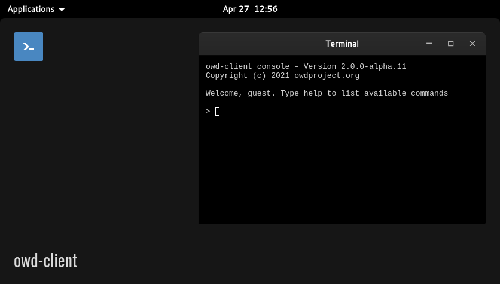

# Xterm.js module for OWD Client
> A terminal for your Open Web Desktop client

<p>
    
</p>

<p>
    <a href="LICENSE"></a>
    <a href="https://github.com/owdproject/owd-client"></a>
    <a href="https://github.com/topics/owd-modules"></a>
    <a href="https://hacklover.net/patreon"></a>
    <a href="https://hacklover.net/discord"></a>
</p>

## Demo
[Try it out](https://hacklover.net/client), just open the terminal from the application menu

## Overview
This terminal is based on [xterm.js](https://github.com/xtermjs/xterm.js) and includes some addons like [xterm.js Fit](https://github.com/xtermjs/xterm.js/tree/master/addons/xterm-addon-fit) and a custom version of [Local Echo](https://github.com/wavesoft/local-echo).

## Quick install
- Move to your client folder, then
  ```
  # Install this module with Npm
  npm install https://github.com/hacklover/owd-app-terminal-xterm
  
  # Or using Yarn
  yarn add https://github.com/hacklover/owd-app-terminal-xterm
  ```
- Define this module in `owd-client/client.extensions.ts`
  ```js
  import AboutModule from "@owd-client/core/src/modules/app/about";
  import DebugModule from "@owd-client/core/src/modules/app/debug";
  import TerminalXtermModule from "owd-app-terminal-xterm/client";

  export default {
    app: {
      modules: [
        AboutModule,
        DebugModule,
        TerminalXtermModule,
      ]
    },
    ...
  ```
- Add this code to `owd-client/vite.config.ts`
  ```
  optimizeDeps: {
    include: ['md5']
  }
  ```
- Copy the content of the [client/config](https://github.com/hacklover/owd-app-terminal-xterm/tree/master/client/config) folder into `owd-client/config`

## Add commands
OWD Client supports terminal commands. You can define them from any OWD module by adding the `setupCommands()` method to the `index.ts` file like this:

```js
setupCommands({store}) {
  return {
    'help': function (t, args) {
      t.writeln('\r\n\r\nHello there!')
    }
  }
}
```

## Dependencies
- xterm
- xterm-addon-fit
- xterm-addon-web-links
- hacklover/xterm-addon-local-echo

## Compatibility
- Open Web Desktop client v2.0.0-beta.1

## License
This project is released under the [MIT License](LICENSE)